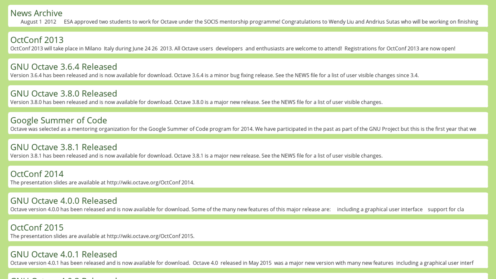

# RSS Feed TV

The purpose of this project was to make a super lightweight RSS feed viewer, that
would run on my raspberry pi, so I could watch a certain feed on my TV.



### Installation
I plan to put prebuilt packages in the releases section of this repository in
the future. For now, this project uses conan and will download the dependencies
for you. You need opensans.ttf for this program to run, and you also need a
settings.toml file. Both need to be in the same directory.

### Settings

To pick your preferences, create a settings.toml file in the same directory
as the executble. Here is an example settings.toml:

```toml
[ui]
animate = true
sidebar = true # currently unused
max_title = 64
max_description = 190
max_framerate = 24

[feed]
uri = "http://www.gnu.org/software/octave/feed.xml" # No SSL support yet
check_delay = 2700000
```

The settings file shown above is setup for the octave feed as an example,
to pick your own feed, you need to change the uri line under the feed section.